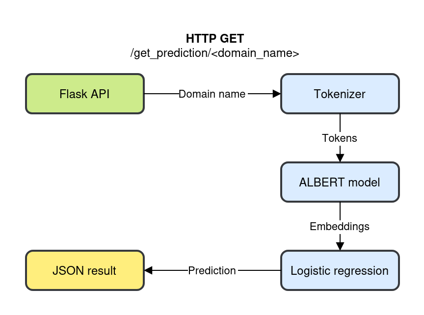

# Natural Language Processing - DGA Detector

This is a Flask web application designed to predict whether a domain name is real or potentially generated by a Domain Generation Algorithm (DGA).

To make predictions, the app uses the ALBERT (A Lite BERT) model, which can capture the semantic meaning of URLs. The model extracts embeddings, 9,000 embeddings trained a logistic regression model. The classification model (`models/base_lr.pkl`) is then used to classify embeddings of a domain name and determine whether it is legitimate or not. 

There are two endpoints:

- GET `/get_prediction/<url_string>` to predict the classification of a single domain name passed as URL-encoded string in the route. The URL is passed as an argument in the route without defining the protocol.
If a domain name is invalid, an HTTP status code of 422 is returned.

- POST `/get_predictions` - to predict the classification of multiple domain names passed as a JSON payload in the form of `{"url_string":"any text google.com any text otherlink.com http://morelinks.org"}`. The URLs can be passed with or without "http" and "https". If no valid domain name is found, an HTTP status code of 422 is returned.

In both cases, a JSON object will be returned as the response. The key is the domain name, and the value is the relevant classification results.

Example response:

    {
        "google.com": {
            "classification": "legit",
            "p_dga": 0.0051598137498390685,
            "p_legit": 0.9948401862501609,
        }
    }

## Setup Instruction

Clone the repository

    git clone https://github.com/Erxathos/DGA-Detector.git

Install poetry

    pip3 install poetry

Install dependencies

    poetry install

## Try it

Start the server inside the poetry environment with gunicorn or flask

    poetry run flask --app dga_detector.api run

The initial run may require some time as it downloads the ALBERT model in the background.

Send requests

    curl http://localhost:5000/get_prediction/google.com

    curl -H "Content-Type: application/json" -X POST -d '{"url_string": "www.google.com or lkfgjldfjldjlg.com"}' http://localhost:5000/get_predictions

## Performance

On my laptop's CPU, it takes approximately 70ms to complete a GET request for http://localhost:5000/get_prediction/google.com

## Test it

Run the unit tests for modules covered with `pytest`:

    pytest

## Validity of the URLs

The URL parser relies on `tldextract` and `urlextract` to identify and validate URLs. To function correctly, these libraries require caching of top level domains.
The parser also excludes IP addresses (v4 and v6).

## What is not done / not published

- Training code
- Train on the full data set
- Docker image
- Deploy
- Database
- Caching
- Monitoring
- Scheduled auto-retrain
